# BLW York Hub — Production Data Model

> Derived from `BLW_York_Hub_v2.html` and the production contracts defined in the branch brief.
> No migrations are created by this document. This is the design contract only.

---

## Core Invariant

**ONE HUMAN = ONE PERSON RECORD.**

A person's `id` must never change when moving from Contact → Member.
`contacts` and `memberships` are relationship records describing a person's *current ministry state*, not separate human identities.

---

## Entities

### `people`

The single source of truth for human identity.

| Column | Type | Notes |
|---|---|---|
| `id` | `uuid` PK | Generated, stable forever |
| `first_name` | `text NOT NULL` | |
| `last_name` | `text NOT NULL` | |
| `email` | `text UNIQUE` | Nullable — may be unknown at first contact |
| `phone` | `text UNIQUE` | Nullable |
| `campus` | `text` | e.g. "York University" |
| `created_at` | `timestamptz DEFAULT now()` | |
| `updated_at` | `timestamptz` | Updated by trigger |

**Uniqueness:** email and phone each have a UNIQUE constraint (partial: `WHERE email IS NOT NULL`, `WHERE phone IS NOT NULL`) to prevent duplicate person creation. Before inserting, check for matching email/phone and warn.

**Does NOT contain:** stage, role, visit count, rep assignment, cell assignment — all modeled separately.

---

### `contacts`

Ministry relationship record for someone who is not yet a member.

| Column | Type | Notes |
|---|---|---|
| `id` | `uuid` PK | |
| `person_id` | `uuid FK → people.id NOT NULL` | |
| `source` | `text` | `vari_hall \| instagram \| sunday_guest \| outreach \| referral \| bible_study \| other` |
| `stage` | `text` | `contacted \| following_up \| invited \| connected \| membership_review` |
| `rep_id` | `uuid FK → people.id` | The member responsible for this contact |
| `first_contact_date` | `date` | When outreach first occurred |
| `notes` | `text` | Free-form context |
| `created_at` | `timestamptz DEFAULT now()` | |
| `updated_at` | `timestamptz` | |

**Constraint:** `UNIQUE(person_id)` — one active contact record per person.

**Historical behavior:** When a contact converts to member, this record is NOT deleted. It is retained as historical context. The presence of a `contacts` row does not determine membership status — `memberships` does.

**Stage:** Updated by reps and coordinators as outreach progresses. "Membership Review" is surfaced when the contact meets the attendance threshold, but the stage update is not automatic — it is triggered by the derived attendance count reaching the threshold.

---

### `memberships`

Active membership relationship. Created when a contact is formally converted.

| Column | Type | Notes |
|---|---|---|
| `id` | `uuid` PK | |
| `person_id` | `uuid FK → people.id NOT NULL` | |
| `status` | `text NOT NULL DEFAULT 'active'` | `active \| inactive \| suspended` |
| `role` | `text NOT NULL DEFAULT 'member'` | `member \| cell_leader \| coordinator \| admin` |
| `joined_at` | `date NOT NULL` | Date of formal conversion |
| `created_at` | `timestamptz DEFAULT now()` | |
| `updated_at` | `timestamptz` | |

**Constraint:** `UNIQUE(person_id)` — one membership record per person.

**Is someone currently a member?** → `memberships` row exists AND `status = 'active'`.

---

### `membership_transitions`

Audit log of all Contact ↔ Member state changes.

| Column | Type | Notes |
|---|---|---|
| `id` | `uuid` PK | |
| `person_id` | `uuid FK → people.id NOT NULL` | |
| `from_state` | `text` | `contact \| member` |
| `to_state` | `text` | `contact \| member` |
| `converted_at` | `timestamptz NOT NULL DEFAULT now()` | |
| `converted_by` | `uuid FK → people.id NOT NULL` | Authorizing coordinator |
| `notes` | `text` | |

No delete. Historical record only.

---

### `cells`

The primary community unit.

| Column | Type | Notes |
|---|---|---|
| `id` | `uuid` PK | |
| `name` | `text NOT NULL UNIQUE` | e.g. "Phronesis" |
| `leader_id` | `uuid FK → people.id` | Current cell leader |
| `description` | `text` | Brief descriptor |
| `status` | `text NOT NULL DEFAULT 'active'` | `active \| inactive` |
| `created_at` | `timestamptz DEFAULT now()` | |
| `updated_at` | `timestamptz` | |

---

### `person_cell_relationships`

Tracks a person's integration state within a cell. Supports history.

| Column | Type | Notes |
|---|---|---|
| `id` | `uuid` PK | |
| `person_id` | `uuid FK → people.id NOT NULL` | |
| `cell_id` | `uuid FK → cells.id NOT NULL` | |
| `state` | `text NOT NULL` | `assigned \| introduced \| connected \| member` |
| `assigned_at` | `timestamptz NOT NULL DEFAULT now()` | |
| `ended_at` | `timestamptz` | Nullable — set when relationship ends |
| `created_at` | `timestamptz DEFAULT now()` | |

**Constraint:** `UNIQUE(person_id, cell_id)` on active relationships (WHERE `ended_at IS NULL`).

**Invariant:** `cell_id != NULL` is NOT proof of cell integration. Check `state` — a person may be `assigned` but not yet `connected`.

---

### `contact_interactions`

Every outreach touch — call, text, WhatsApp, in-person, etc.

| Column | Type | Notes |
|---|---|---|
| `id` | `uuid` PK | |
| `person_id` | `uuid FK → people.id NOT NULL` | The contact being interacted with |
| `rep_id` | `uuid FK → people.id` | Who made contact (may differ from contact's assigned rep) |
| `interaction_type` | `text NOT NULL` | `call \| text \| whatsapp \| in_person \| outreach \| service_invitation \| bible_study_invitation \| follow_up \| other` |
| `occurred_at` | `timestamptz NOT NULL` | When the interaction happened |
| `notes` | `text` | What was discussed, next steps |
| `created_by` | `uuid FK → people.id NOT NULL` | Who recorded this in the system |
| `created_at` | `timestamptz DEFAULT now()` | |

**No updates.** Interactions are append-only. If an interaction was recorded incorrectly, log a correction interaction with a note. Audit via `audit_events`.

---

### `follow_ups`

Scheduled next steps for contacts.

| Column | Type | Notes |
|---|---|---|
| `id` | `uuid` PK | |
| `person_id` | `uuid FK → people.id NOT NULL` | The contact who needs follow-up |
| `owner_id` | `uuid FK → people.id NOT NULL` | Who is responsible |
| `due_date` | `date NOT NULL` | When follow-up is expected |
| `status` | `text NOT NULL DEFAULT 'open'` | `open \| completed \| cancelled` |
| `context` | `text` | Why this follow-up exists |
| `created_by` | `uuid FK → people.id NOT NULL` | |
| `created_at` | `timestamptz DEFAULT now()` | |
| `completed_at` | `timestamptz` | Nullable |
| `completed_by` | `uuid FK → people.id` | Nullable |

**Derived:** "Follow-up due today" = `status = 'open' AND due_date <= today`.

---

### `services`

A Sunday service is a first-class entity.

| Column | Type | Notes |
|---|---|---|
| `id` | `uuid` PK | |
| `service_type` | `text NOT NULL DEFAULT 'sunday_morning'` | `sunday_morning \| special \| other` |
| `title` | `text NOT NULL` | e.g. "Sunday Service · Sep 20, 2026" |
| `starts_at` | `timestamptz NOT NULL` | |
| `location` | `text` | e.g. "FC 152" |
| `status` | `text NOT NULL DEFAULT 'scheduled'` | `scheduled \| active \| completed \| cancelled` |
| `created_at` | `timestamptz DEFAULT now()` | |
| `updated_at` | `timestamptz` | |

**Services are NOT ordinary events.** They own attendance and expectations. The `events` table may reference a service via `service_id`, but events do not carry attendance records.

---

### `service_expectations`

Who is expected at a given service, why, and what their confirmed response is.

| Column | Type | Notes |
|---|---|---|
| `id` | `uuid` PK | |
| `service_id` | `uuid FK → services.id NOT NULL` | |
| `person_id` | `uuid FK → people.id NOT NULL` | |
| `source` | `text NOT NULL` | `attendance_pattern \| outreach \| manual` |
| `response` | `text` | `expected \| confirmed \| maybe \| declined \| null` |
| `attendance_mode` | `text NOT NULL DEFAULT 'in_person'` | `in_person \| online \| unknown` |
| `explanation` | `text` | Snapshot — e.g. "Attended 7 of previous 8 Sunday services" |
| `reason` | `text` | Nullable — used for exceptions/declined (e.g. "Exam") |
| `created_by` | `uuid FK → people.id` | Nullable for system-generated rows |
| `created_at` | `timestamptz DEFAULT now()` | |
| `updated_at` | `timestamptz` | |

**Constraint:** `UNIQUE(service_id, person_id)` — one expectation per person per service.

**Upsert rule:** If outreach changes a contact from Maybe → Confirmed, UPDATE the existing row (`response = 'confirmed'`). Do NOT insert a second row.

**Exception model:** A one-week exception for a regular member is stored by setting `response = 'declined'` and populating `reason`. Source remains `attendance_pattern`. This preserves the "why they were expected" while recording the exception.

**Historical freeze:** `explanation` is written at the time the expectation is generated and never recomputed. If Sep 20 says "7 of previous 8 Sundays," that text survives even if the person misses subsequent services.

---

### `attendance_pattern_snapshots`

Immutable record of what the algorithm saw when it generated a regular-attendance expectation.

| Column | Type | Notes |
|---|---|---|
| `id` | `uuid` PK | |
| `service_id` | `uuid FK → services.id NOT NULL` | |
| `person_id` | `uuid FK → people.id NOT NULL` | |
| `lookback_count` | `int NOT NULL` | Number of past services evaluated (default: 8) |
| `attended_count` | `int NOT NULL` | Number of those services attended |
| `met_threshold` | `boolean NOT NULL` | Whether threshold was satisfied |
| `threshold_used` | `int NOT NULL` | Threshold at generation time (default: 5) |
| `snapshot_at` | `timestamptz NOT NULL DEFAULT now()` | |

**Constraint:** `UNIQUE(service_id, person_id)`.

**Purpose:** Prevents retroactive recomputation of historical expectations. Even if a person's future attendance changes, the Sep 20 record remains "7 of previous 8."

---

### `service_attendance`

Authoritative record of actual attendance.

| Column | Type | Notes |
|---|---|---|
| `id` | `uuid` PK | |
| `service_id` | `uuid FK → services.id NOT NULL` | |
| `person_id` | `uuid FK → people.id NOT NULL` | |
| `status` | `text NOT NULL DEFAULT 'attended'` | `attended \| absent \| excused` |
| `attendance_mode` | `text NOT NULL DEFAULT 'in_person'` | `in_person \| online` |
| `checked_in_at` | `timestamptz` | Nullable — set when checked in at door |
| `checked_in_by` | `uuid FK → people.id` | Nullable |
| `is_walk_in` | `boolean NOT NULL DEFAULT false` | True for unexpected arrivals |
| `created_at` | `timestamptz DEFAULT now()` | |
| `updated_at` | `timestamptz` | |

**Constraint:** `UNIQUE(service_id, person_id)`.

**CRITICAL distinctions:**
- Expectation ≠ Confirmation ≠ Attendance
- Only `service_attendance.status = 'attended'` proves someone came

---

### `events`

Non-service calendar entries.

| Column | Type | Notes |
|---|---|---|
| `id` | `uuid` PK | |
| `title` | `text NOT NULL` | |
| `event_type` | `text NOT NULL` | `sunday_service \| bible_study \| cell_meeting \| outreach \| foundation \| other` |
| `starts_at` | `timestamptz NOT NULL` | |
| `location` | `text` | |
| `description` | `text` | |
| `service_id` | `uuid FK → services.id` | Nullable — links to service workspace if applicable |
| `created_at` | `timestamptz DEFAULT now()` | |
| `updated_at` | `timestamptz` | |

---

### `meetings`

| Column | Type | Notes |
|---|---|---|
| `id` | `uuid` PK | |
| `title` | `text NOT NULL` | |
| `meeting_type` | `text` | `cell_leaders \| executive \| subregion \| other` |
| `scheduled_at` | `timestamptz NOT NULL` | |
| `location` | `text` | URL or room |
| `status` | `text NOT NULL DEFAULT 'planned'` | `planned \| active \| completed \| cancelled` |
| `agenda` | `jsonb` | Nullable — structured agenda items |
| `minutes` | `jsonb` | Nullable — decisions + action items |
| `created_at` | `timestamptz DEFAULT now()` | |
| `updated_at` | `timestamptz` | |

---

### `audit_events`

Append-only record of consequential state changes.

| Column | Type | Notes |
|---|---|---|
| `id` | `uuid` PK | |
| `actor_id` | `uuid FK → people.id` | Nullable for system-initiated events |
| `action` | `text NOT NULL` | e.g. `contact.converted_to_member`, `attendance.corrected`, `rep.reassigned` |
| `entity_type` | `text NOT NULL` | e.g. `people`, `service_attendance`, `contacts` |
| `entity_id` | `uuid NOT NULL` | |
| `before_data` | `jsonb` | Nullable — state before change |
| `after_data` | `jsonb` | Nullable — state after change |
| `created_at` | `timestamptz DEFAULT now()` | |

**No updates or deletes.** Corrections create new audit rows, not edits to existing ones.

---

### `service_config`

Configurable parameters exposed in Admin.

| Column | Type | Notes |
|---|---|---|
| `id` | `uuid` PK | Singleton row (enforce via app layer) |
| `regular_service_day` | `int` | 0=Sunday, 1=Monday, … |
| `attendance_lookback` | `int NOT NULL DEFAULT 8` | Services to look back for pattern calculation |
| `attendance_threshold` | `int NOT NULL DEFAULT 5` | Minimum attended to be "regular" |
| `membership_visit_threshold` | `int NOT NULL DEFAULT 3` | Services attended before membership review |
| `updated_at` | `timestamptz` | |
| `updated_by` | `uuid FK → people.id` | |

---

## Derived Fields (Never Stored as Primary)

| Question | Answer source | Notes |
|---|---|---|
| Contact visit count | `COUNT(service_attendance WHERE person_id = ? AND status = 'attended')` filtered to service_type = sunday_morning | Never store an independently editable `visit_count` |
| Is person a member? | `memberships WHERE person_id = ? AND status = 'active'` | |
| Ready for membership? | visit count ≥ `service_config.membership_visit_threshold` AND no active membership | |
| Who is their rep? | `contacts.rep_id` | |
| What cell are they in? | `person_cell_relationships WHERE ended_at IS NULL` | |
| Follow-up due today? | `follow_ups WHERE status = 'open' AND due_date <= today` | |
| Confirmed but absent? | `service_expectations.response = 'confirmed'` AND no `service_attendance` with `status = 'attended'` | |

---

## Mermaid ER Diagram

```mermaid
erDiagram
    people {
        uuid id PK
        text first_name
        text last_name
        text email
        text phone
        text campus
        timestamptz created_at
        timestamptz updated_at
    }

    contacts {
        uuid id PK
        uuid person_id FK
        text source
        text stage
        uuid rep_id FK
        date first_contact_date
        text notes
        timestamptz created_at
        timestamptz updated_at
    }

    memberships {
        uuid id PK
        uuid person_id FK
        text status
        text role
        date joined_at
        timestamptz created_at
        timestamptz updated_at
    }

    membership_transitions {
        uuid id PK
        uuid person_id FK
        text from_state
        text to_state
        timestamptz converted_at
        uuid converted_by FK
        text notes
    }

    cells {
        uuid id PK
        text name
        uuid leader_id FK
        text description
        text status
        timestamptz created_at
    }

    person_cell_relationships {
        uuid id PK
        uuid person_id FK
        uuid cell_id FK
        text state
        timestamptz assigned_at
        timestamptz ended_at
    }

    contact_interactions {
        uuid id PK
        uuid person_id FK
        uuid rep_id FK
        text interaction_type
        timestamptz occurred_at
        text notes
        uuid created_by FK
        timestamptz created_at
    }

    follow_ups {
        uuid id PK
        uuid person_id FK
        uuid owner_id FK
        date due_date
        text status
        text context
        uuid created_by FK
        timestamptz created_at
        timestamptz completed_at
        uuid completed_by FK
    }

    services {
        uuid id PK
        text service_type
        text title
        timestamptz starts_at
        text location
        text status
        timestamptz created_at
        timestamptz updated_at
    }

    service_expectations {
        uuid id PK
        uuid service_id FK
        uuid person_id FK
        text source
        text response
        text attendance_mode
        text explanation
        text reason
        uuid created_by FK
        timestamptz created_at
        timestamptz updated_at
    }

    attendance_pattern_snapshots {
        uuid id PK
        uuid service_id FK
        uuid person_id FK
        int lookback_count
        int attended_count
        boolean met_threshold
        int threshold_used
        timestamptz snapshot_at
    }

    service_attendance {
        uuid id PK
        uuid service_id FK
        uuid person_id FK
        text status
        text attendance_mode
        timestamptz checked_in_at
        uuid checked_in_by FK
        boolean is_walk_in
        timestamptz created_at
        timestamptz updated_at
    }

    events {
        uuid id PK
        text title
        text event_type
        timestamptz starts_at
        text location
        uuid service_id FK
        timestamptz created_at
    }

    meetings {
        uuid id PK
        text title
        text meeting_type
        timestamptz scheduled_at
        text location
        text status
        jsonb agenda
        jsonb minutes
        timestamptz created_at
    }

    audit_events {
        uuid id PK
        uuid actor_id FK
        text action
        text entity_type
        uuid entity_id
        jsonb before_data
        jsonb after_data
        timestamptz created_at
    }

    service_config {
        uuid id PK
        int regular_service_day
        int attendance_lookback
        int attendance_threshold
        int membership_visit_threshold
        timestamptz updated_at
        uuid updated_by FK
    }

    people ||--o{ contacts : "has contact relationship"
    people ||--o| memberships : "has membership"
    people ||--o{ membership_transitions : "transition history"
    people ||--o{ person_cell_relationships : "cell memberships"
    people ||--o{ contact_interactions : "outreach history"
    people ||--o{ follow_ups : "follow-up queue"
    people ||--o{ service_expectations : "expected at services"
    people ||--o{ service_attendance : "attendance records"
    people ||--o{ audit_events : "actor"
    contacts ||--o| people : "rep (owner)"
    cells ||--o{ person_cell_relationships : "members"
    cells ||--o| people : "leader"
    services ||--o{ service_expectations : "expected list"
    services ||--o{ service_attendance : "attendance"
    services ||--o{ attendance_pattern_snapshots : "pattern freeze"
    services ||--o| events : "linked event"
    membership_transitions ||--o| people : "converted_by"
```

